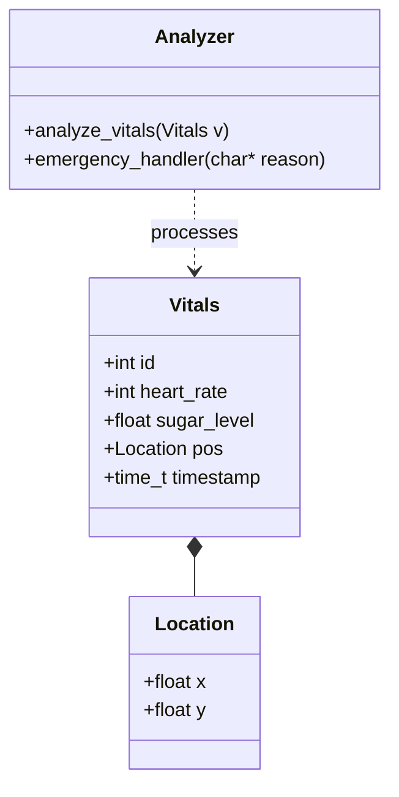
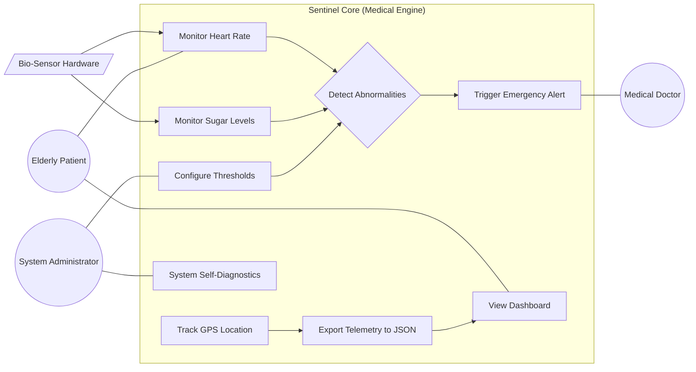
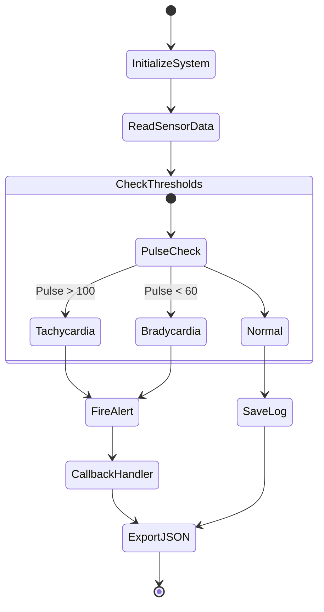
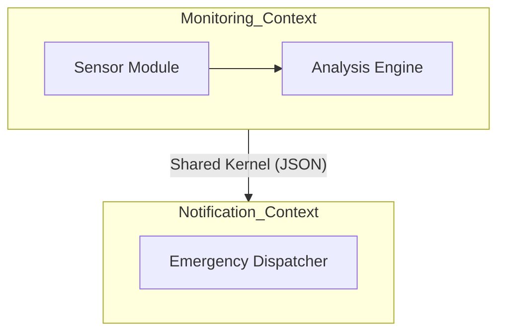
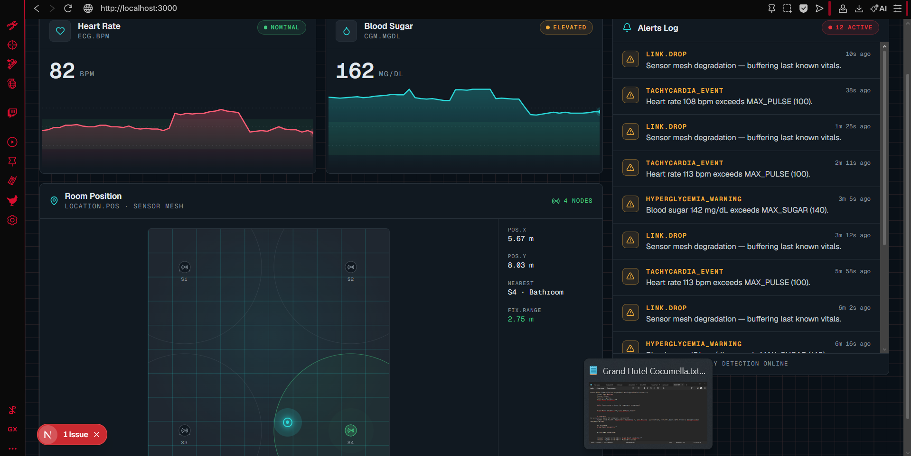

## Project Navigation (Requirement 1-13 Checklist)

| # | Task Topic | Links |
|---|------------|-------|
| 1 | **GIT & Time-Travel** | [GIT_EXP.md](./documents/GIT_EXP.md) |
| 2 | **Requirements & Constitution**  | [CONSTITUTION.md](./CONSTITUTION.md) |
| 3 | **Classic & AI Analysis** | [MARKET_ANALYSIS.md](./documents/analysis/Germany_AAL_Market_Analysis_2025.md) |
| 4 | **UML Diagrams** | *See below in README* |
| 5 | **DDD (Domain Driven Design)** | *See below in README* |
| 6 | **Clean Code Development** | [CCD_CheatSheet.md](./documents/CCD_CheatSheet.md) |
| 7 | **Refactoring** | [REFACTORING.md](./documents/REFACTORING.md) |
| 8 | **Testing (Unit & Mock)** | [tests.c](./core/tests.c) |
| 9 | **Build Management** | [Makefile](./core/Makefile) |
| 10| **Continuous Delivery** | [.github/workflows/main.yml](./.github/workflows/main.yml) |
| 11| **Metrics** | [METRICS.md](./documents/METRICS.md) |
| 12| **Architecture Canvas** | [ARCHITECTURE.md](./documents/ARCHITECTURE.md) |
| 13| **VIBE / Agentic Coding** | [VIBE_LOG.md](./documents/VIBE_LOG.md) |

---

## 4. UML Diagrams (Requirement #4)

### A. Class Diagram
A. Class Diagram 

B. Use-Case Diagram

C. Activity Diagram

5. DDD - Domain Driven Design (Requirement #5)
Core Domain Chart
Core Domain: VitalsAnalytics (High-priority logic for life-saving alerts).
Supporting Domain: Networking (Data transfer via simulated JSON space).
Generic Domain: Logging/UI (Standard dashboard components).
Bounded Context Map

13. VIBE CODING & DISTRIBUTED APP (Requirement #13)
This project has been transformed into a Distributed System using Agentic Coding (v0.app / AI Agents).
Core Module (C): High-performance embedded engine for data processing.
Dashboard Module (Next.js/TS): A modern visualization layer for healthcare providers.
Evidence of Vibe Coding Process: VIBE_LOG.md
Final System Screenshot:

Personal SE Experiences & Mistakes
Git Failure: During a merge, I corrupted the vitals.h file. I used git reflog to find the stable state before the mess and git reset --hard to recover.
Build Failure: The Windows environment didn't have make installed. I documented this in METRICS.md and provided a build.bat workaround.
Clean Code: I refactored the legacy.c (monolith) into a modular structure, which allowed me to implement Requirement #8 (Unit Testing) effectively.
