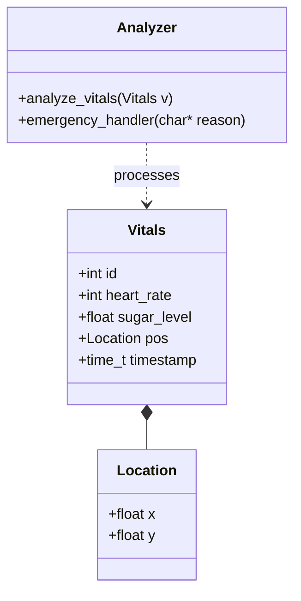
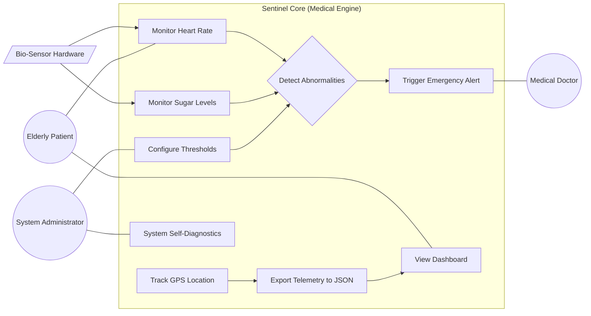
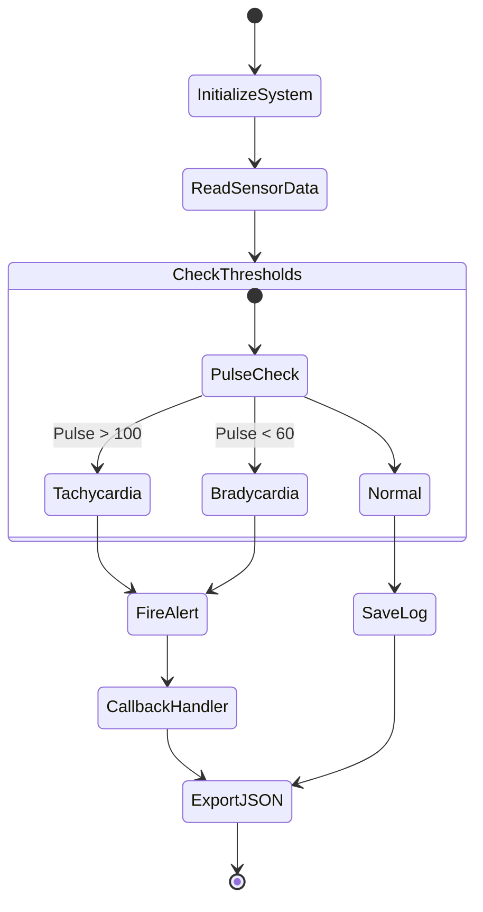

## Project Navigation (Requirement 0-15 Checklist)

| # | Task Topic | Links |
|---|------------|-------|
| 0 | **Pet Project (Sentinel-Core)** | [core/](./core) |
| 1 | **GIT & Time-Travel** | [Screenshot](./images/image-1.png) · [GIT_EVIDENCE.md](./documents/GIT_EVIDENCE.md) |
| 2 | **Requirements** | [SPEC.md](./documents/SPEC.md) · [VALIDATION.md](./documents/VALIDATION.md) |
| 3 | **Classic & AI Analysis** | [MARKET_ANALYSIS.md](./documents/Germany_AAL_Market_Analysis_2025.md) · [AI_Market_Analysis.md](./documents/AI_Market_Analysis.md) |
| 4 | **UML Diagrams** | *See below in README* |
| 5 | **DDD (Domain Driven Design)** | *See below in README* |
| 6 | **Clean Code Development** | [CCD_PartA.md](./documents/CCD_PartA.md) · [CCD_CheatSheet.pdf](./CCD_CheatSheet.pdf) |
| 7 | **Refactoring** | [REFACTORING.md](./documents/REFACTORING.md) |
| 8 | **Testing (Unit & Mock)** | [tests.c](./core/tests.c) |
| 9 | **Build Management** | [build.bat](./core/build.bat) |
| 10| **Continuous Delivery** | [.github/workflows/main.yml](./.github/workflows/main.yml) |
| 11| **Metrics** | [METRICS.md](./documents/METRICS.md) |
| 12| **Architecture Canvas** | [ARCHITECTURE.md](./documents/ARCHITECTURE.md) |
| 13| **Functional Programming** | [AGENTIC_PROJECT/FUNCTIONAL_PROGRAMMING.md](./AGENTIC_PROJECT/FUNCTIONAL_PROGRAMMING.md) |
| 14| **Vibe / Agentic Coding** (counts double) | [AGENTIC_PROJECT/VIBE_CODING.md](./AGENTIC_PROJECT/VIBE_CODING.md) |
| 15| **Pet Project 2 — Deployed Distributed App** | [AGENTIC_PROJECT/README.md](./AGENTIC_PROJECT/README.md) |

**Personal SE experiences (Git recovery, CI/CD Node version mismatch, POSIX
vs C11 build issue) live in their own section below, separate from the
numbered checklist** — see "Personal SE Experiences & Mistakes" further
down in this README.
---

## 4. UML Diagrams (Requirement #4)

### A. Class Diagram
A. Class Diagram 


B. Use-Case Diagram

C. Activity Diagram

# 5. DDD — Domain Driven Design (Requirement #5)

## A. Core Domain Chart

Domains ranked by business differentiation vs. business generality
(classic Core / Supporting / Generic split):

```
graph TD
    subgraph Core["CORE DOMAIN — high differentiation, high value"]
        VA["VitalsAnalytics<br/>(threshold detection, emergency triggering)"]
    end
    subgraph Supporting["SUPPORTING DOMAIN"]
        NET["Networking<br/>(JSON telemetry export/transfer)"]
        DISP["Emergency Dispatch<br/>(routing alerts to recipients)"]
    end
    subgraph Generic["GENERIC DOMAIN — off-the-shelf, low differentiation"]
        LOG["Logging"]
        UI["Dashboard UI components"]
    end

    VA -->|emits events to| DISP
    VA -->|telemetry via| NET
    NET -->|feeds| UI
    VA -.->|writes| LOG
```

**Rationale:**
- **Core** — `VitalsAnalytics` is where the actual medical/business value lives: detecting life-threatening readings correctly is the entire reason the product exists. This is where the team should invest the most design effort.
- **Supporting** — Networking and Dispatch are necessary but not differentiating; they could be swapped for a different transport/notification mechanism without changing what makes the product valuable.
- **Generic** — Logging and dashboard widgets are solved problems; off-the-shelf libraries are appropriate here, no custom modeling needed.

## B. Bounded Context Map

```
graph TD
    subgraph MC["Monitoring Context"]
        Sensor["Sensor Module"]
        Analyzer["Analysis Engine<br/>(analyze_vitals)"]
        Sensor --> Analyzer
    end

    subgraph NC["Notification Context"]
        Dispatcher["Emergency Dispatcher<br/>(emergency_handler)"]
    end

    subgraph PC["Presentation Context"]
        Dashboard["Dashboard<br/>(Next.js)"]
    end

    MC -- "Shared Kernel (JSON schema: heart_rate, sugar, timestamp)" --> NC
    MC -- "Shared Kernel (JSON telemetry file)" --> PC
```

**Relationship types:**
- **Monitoring → Notification:** *Shared Kernel* — both contexts agree on a
  minimal shared vocabulary (the alert `reason` string), but Notification
  does not depend on Monitoring's internal `Vitals` struct.
- **Monitoring → Presentation:** *Shared Kernel* via the JSON telemetry
  contract (`data.json`) — Dashboard only depends on the JSON shape, not on
  Core's C implementation. This is intentionally a weak coupling so the two
  can be developed/deployed independently.

## C. Event Storming

Legend: 🟧 Domain Event · 🟦 Command · 🟨 Actor/Role · 🟩 Policy

```
graph LR
    A1["🟨 Bio-Sensor"] -->|"🟦 Read Vitals"| E1["🟧 VitalsRead"]
    E1 -->|triggers| P1["🟩 Policy:<br/>Evaluate thresholds"]
    P1 -->|"🟦 Analyze Vitals"| E2{"🟧 ThresholdBreached?"}
    E2 -->|yes: HR > 100| E3["🟧 TachycardiaDetected"]
    E2 -->|yes: sugar > 140| E4["🟧 HyperglycemiaDetected"]
    E2 -->|no| E5["🟧 VitalsLogged"]
    E3 --> P2["🟩 Policy:<br/>Notify on any critical event"]
    E4 --> P2
    P2 -->|"🟦 Dispatch Alert"| E6["🟧 EmergencyAlertFired"]
    E6 -->|"🟦 Export Telemetry"| E7["🟧 TelemetryExported"]
    E5 -->|"🟦 Export Telemetry"| E7
    E7 -->|consumed by| A2["🟨 Doctor (via Dashboard)"]
```

**Key domain events identified:** `VitalsRead`, `TachycardiaDetected`,
`HyperglycemiaDetected`, `VitalsLogged`, `EmergencyAlertFired`,
`TelemetryExported`.

**Insight from the exercise:** `TachycardiaDetected` and
`HyperglycemiaDetected` are currently modeled as two independent `if`
checks producing an alert string (see `analyze_vitals` in `vitals.c`) — the
event storming makes explicit that these are two *distinct* domain events
that happen to share one policy (notify), which is a candidate for future
refactoring (e.g. an `AlertType` enum instead of raw strings, see
`REFACTORING.md`).
13. VIBE CODING & DISTRIBUTED APP (Requirement #13)
This project has been transformed into a Distributed System using Agentic Coding (v0.app / AI Agents).
Core Module (C): High-performance embedded engine for data processing.
Dashboard Module (Next.js/TS): A modern visualization layer for healthcare providers.
Evidence of Vibe Coding Process: VIBE_LOG.md
Final System Screenshot:

Personal SE Experiences & Mistakes
Git Failure: During a merge, I corrupted the vitals.h file. I used git reflog to find the stable state before the mess and git reset --hard to recover.
Build Failure: The Windows environment didn't have make installed. I documented this in METRICS.md and provided a build.bat workaround.
Clean Code: I refactored the legacy.c (monolith) into a modular structure, which allowed me to implement Requirement #8 (Unit Testing) effectively.
