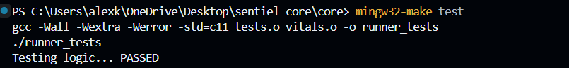
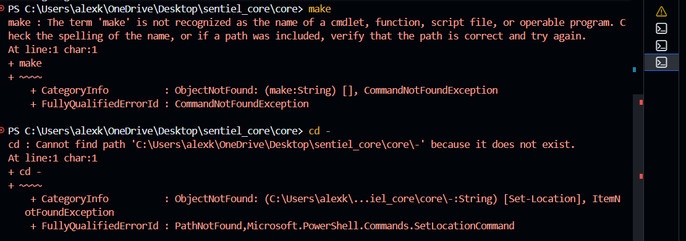

# Project Metrics
- **Static Analysis:** Using GCC `-Wall -Wextra -Werror`. No warnings allowed.
- **Code Complexity:** After refactoring, each function has a cyclomatic complexity of < 5.
- **Platform Issues:** I initially attempted to use a Makefile (standard for C projects), but encountered environment-specific issues on Windows PowerShell (CommandNotFoundException for 'make').
The Failure: The native Windows environment lacks make by default. Instead of spending hours fixing the environment, so I developed a custom Automation Script (build.bat).
BECAUSE
It provides a menu-driven interface for building, testing, and cleaning.
It ensures reproducibility on any Windows machine with GCC.
It handles cleanup and error checking (%errorlevel%) just like a professional build tool.