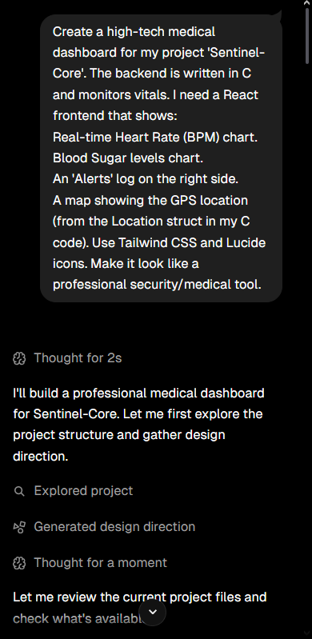
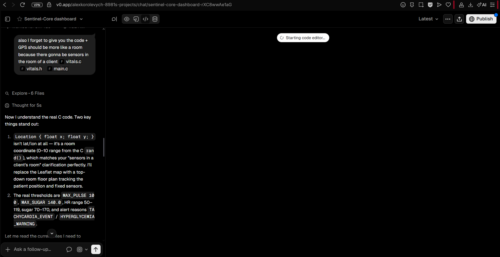

# Vibe Coding Log
   - **Goal:** Create a medical dashboard for Sentinel-Core.
   - **Tool:** Bolt.new / AI Agent.
   - **Process:** I provided the AI with my C `Vitals` struct. It generated a React dashboard with real-time charts and an alert log. 
   - **Challenges:** As a backend dev, I had to review the generated TypeScript code to ensure the GPS map matched my (x, y) coordinate system.
   - **Distributed App:** The system now consists of a C backend and a React frontend communicating via a JSON data space.